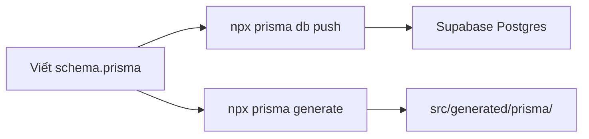
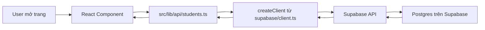
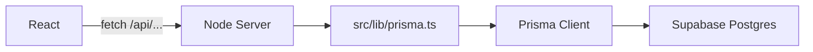

# Supabase + Prisma trong dự án Student Attendance Management

Tài liệu mô tả các thay đổi liên quan Supabase và Prisma, luồng chạy, ý nghĩa từng file, và hướng dẫn vận hành.

---

## 1. Tổng quan kiến trúc

Dự án là **Vite + React + React Router** (SPA), **không phải Next.js**.

```
┌─────────────────────────────────────────────────────────────────┐
│                        DEVELOPER (CLI)                          │
│  prisma/schema.prisma  →  npx prisma db push / generate         │
└───────────────────────────────┬─────────────────────────────────┘
                                │ tạo/cập nhật bảng
                                ▼
┌─────────────────────────────────────────────────────────────────┐
│              Supabase Postgres (cloud)                          │
│  Bảng: Grade, Class, User, AttendanceRecord                     │
└───────────────────────────────┬─────────────────────────────────┘
                                │ đọc/ghi lúc runtime
                                ▼
┌─────────────────────────────────────────────────────────────────┐
│  React App (browser)                                            │
│  pages/*.tsx  →  src/lib/api/*.ts  →  src/lib/supabase/client  │
└─────────────────────────────────────────────────────────────────┘
```

### Vai trò từng công cụ

| Công cụ | Vai trò | Chạy ở đâu |
|---------|---------|------------|
| **Prisma Schema** | Định nghĩa model, quan hệ bảng | File `prisma/schema.prisma` |
| **Prisma CLI** | `db push`, `generate`, (migrate) | Terminal / CI |
| **Prisma Client** | Query ORM type-safe | **Chỉ Node/server** — không dùng trong Vite browser |
| **Supabase Postgres** | Database thật (host bởi Supabase) | Cloud |
| **Supabase Client** | Query từ React qua HTTP/PostgREST | Browser |

**Quan trọng:** Prisma và Supabase **cùng trỏ vào một Postgres** trên Supabase. Prisma quản lý **cấu trúc** bảng; Supabase client dùng để **truy vấn** từ frontend.

---

## 2. Luồng chạy chi tiết

### 2.1. Luồng setup database (một lần / khi đổi schema)



1. Sửa `prisma/schema.prisma` (model, field, relation).
2. Chạy `npx prisma db push` — đồng bộ schema lên Supabase (tạo/sửa bảng).
3. Chạy `npx prisma generate` (hoặc tự chạy qua `postinstall`) — sinh TypeScript client vào `src/generated/prisma/`.

> **Lưu ý:** `npx prisma migrate dev` thường **treo** trên Supabase (pooler 6543 + shadow database). Dùng **`db push`** khi dev. Xem mục 6.

### 2.2. Luồng app khi chạy (runtime)



1. Page (ví dụ `Students.tsx`) gọi hàm trong `src/lib/api/`.
2. API layer tạo Supabase client và gọi `.from(...).select(...)`.
3. Supabase trả data từ Postgres.

**Hiện trạng:** Hầu hết page vẫn dùng `src/data/mockData.ts`. Chỉ `src/lib/api/students.ts` đã chuẩn bị sẵn — chưa được wire vào UI.

### 2.3. Luồng Prisma Client (tương lai — cần server)



`src/lib/prisma.ts` **không import được** trong component React. Chỉ dùng khi có folder `server/` riêng (Express, Hono, …).

---

## 3. Cấu trúc file liên quan

```
student-attendance-management/
├── .env                          # Biến môi trường (Vite + Prisma CLI)
├── prisma.config.ts              # Cấu hình Prisma 7 (URL DB cho CLI)
├── prisma/
│   └── schema.prisma             # Định nghĩa model DB
├── src/
│   ├── generated/prisma/         # Auto-generated — KHÔNG sửa tay
│   ├── lib/
│   │   ├── api/
│   │   │   └── students.ts       # Data access layer (Supabase)
│   │   ├── prisma.ts             # Prisma singleton (cho server tương lai)
│   │   └── supabase/
│   │       ├── client.ts         # Supabase browser client ✅ dùng
│   │       └── server.ts         # Next.js pattern ❌ chưa dùng được
│   └── data/mockData.ts          # Dữ liệu giả — đang dùng ở UI
└── docs/
    └── SUPABASE-PRISMA.md        # File này
```

### File đã loại bỏ (không còn trong repo)

| File cũ | Lý do xóa |
|---------|-----------|
| `src/app/api/students/route.ts` | Pattern Next.js (`next/server`) — **Vite không hỗ trợ** API routes |

---

## 4. Chi tiết từng file

### 4.1. `.env`

| Biến | Mục đích | Ai đọc |
|------|----------|--------|
| `VITE_SUPABASE_URL` | URL project Supabase | Vite → browser |
| `VITE_SUPABASE_PUBLISHABLE_KEY` | Anon/publishable key (public) | Vite → browser |
| `DATABASE_URL` | Pooler port **6543** (`?pgbouncer=true`) | Prisma runtime trên server (tương lai) |
| `DIRECT_URL` | Session pooler port **5432** | **Prisma CLI** (`db push`, migrate) |

**Quy ước Vite:** Chỉ biến prefix `VITE_` mới expose ra frontend. Không dùng `NEXT_PUBLIC_*` trong project Vite.

**Hai file env trong monorepo:**

- `student-attendance-management/.env` — file **Prisma CLI và Vite đọc**.
- `../.env.local` (thư mục cha) — copy gốc credentials; nên đồng bộ vào `.env` con.

**Đã bỏ:** URL `prisma+postgres://localhost:51213/...` (Prisma Postgres local) — gây lỗi port 51214, không liên quan Supabase.

---

### 4.2. `prisma.config.ts`

Prisma 7 **không** đặt connection URL trong `schema.prisma` nữa — chuyển sang file config:

```ts
datasource: {
  url: process.env["DIRECT_URL"],
  directUrl: process.env["DIRECT_URL"],
}
```

- CLI (`db push`) dùng `DIRECT_URL` (port 5432), **không** dùng pooler 6543.
- Pooler 6543 treo khi chạy DDL (CREATE TABLE, migration).

---

### 4.3. `prisma/schema.prisma`

Định nghĩa 4 model chính:

| Model | Ý nghĩa |
|-------|---------|
| `Grade` | Khối/lớp (Grade 10, 11, …) |
| `Class` | Lớp học, thuộc một `Grade` |
| `User` | Người dùng (admin / teacher / student), thuộc một `Class` |
| `AttendanceRecord` | Bản ghi điểm danh |

**Enum:**

- `UserRole`: `admin`, `student`, `teacher`
- `AttendanceStatus`: `present`, `absent`, `excused_absence`

**Quan hệ đặc biệt — `AttendanceRecord` ↔ `User` (2 chiều):**

- `student` → học sinh được điểm danh (`@relation("StudentAttendance")`)
- `createdBy` → giáo viên/admin tạo bản ghi (`@relation("CreatedByAttendance")`)

Prisma **bắt buộc** đặt tên relation khi một model trỏ tới cùng model 2 lần.

**Tên bảng trên Supabase:** Mặc định PascalCase — `Grade`, `Class`, `User`, `AttendanceRecord` (không phải `students`).

**Generator:**

```prisma
output = "../src/generated/prisma"
```

Client sinh ra ngoài `node_modules`, import từ `src/generated/prisma/client`.

---

### 4.4. `src/generated/prisma/` (auto-generated)

- Sinh bởi `npx prisma generate`.
- Chạy tự động sau `npm install` (`postinstall` trong `package.json`).
- **Không commit** (đã có trong `.gitignore`).
- Cung cấp type và API: `prisma.user.findMany()`, `prisma.grade.create()`, …

---

### 4.5. `src/lib/prisma.ts`

Singleton `PrismaClient` cho môi trường Node:

```ts
import { PrismaClient } from "../generated/prisma/client";
export const prisma = ...
```

**Trạng thái:** File sẵn sàng nhưng **chưa được import** ở page/component. Dùng khi có backend server.

---

### 4.6. `src/lib/supabase/client.ts`

Supabase client cho **browser**:

```ts
createBrowserClient(
  import.meta.env.VITE_SUPABASE_URL,
  import.meta.env.VITE_SUPABASE_PUBLISHABLE_KEY
)
```

Đây là entry point duy nhất Supabase nên dùng từ React.

---

### 4.7. `src/lib/supabase/server.ts`

Dùng `@supabase/ssr` + `cookies()` từ **`next/headers`** — pattern Next.js App Router.

**Trạng thái:** ❌ Không tương thích Vite SPA. Có thể xóa hoặc giữ cho tương lai nếu migrate sang Next.js.

---

### 4.8. `src/lib/api/students.ts`

**Data access layer** — không phải HTTP API route:

```ts
export async function getStudents() {
  const supabase = createClient();
  return supabase.from("students").select("*, attendance(*)");
}
```

**Cần sửa khi dùng thật:**

- Tên bảng: `"User"` (không phải `"students"`), filter `role = 'student'`.
- Tên relation Supabase phải khớp schema Prisma.
- Cần **RLS policies** trên Supabase Dashboard.

**Pattern khuyến nghị:** Mỗi entity một file — `classes.ts`, `grades.ts`, `attendance.ts`, `users.ts`.

---

### 4.9. `package.json` — dependencies mới

```json
"dependencies": {
  "@prisma/client": "^7.8.0",
  "@supabase/ssr": "^0.10.3",
  "@supabase/supabase-js": "^2.108.0",
  "prisma": "^7.8.0"
}
```

Script:

```json
"postinstall": "prisma generate"
```

---

## 5. So sánh: Prisma vs Supabase trong project

| Tác vụ | Dùng gì | Lệnh / File |
|--------|---------|-------------|
| Tạo bảng | Prisma | `npx prisma db push` |
| Sinh TypeScript types ORM | Prisma | `npx prisma generate` |
| Query từ React | Supabase | `src/lib/api/*.ts` |
| Auth (khuyến nghị) | Supabase Auth | Chưa tích hợp — đang mock `AppContext` |
| Bảo mật row-level | Supabase RLS | Cần cấu hình trên Dashboard |

---

## 6. Lệnh CLI thường dùng

```bash
# Đồng bộ schema → Supabase (dev)
npx prisma db push

# Sinh client TypeScript
npx prisma generate

# Kiểm tra schema hợp lệ
npx prisma validate

# Mở GUI xem data
npx prisma studio
```

### Vì sao `migrate dev` treo?

| Nguyên nhân | Giải thích |
|-------------|------------|
| Pooler **6543** | Transaction pooler không hỗ trợ DDL → treo vô hạn |
| **Shadow database** | `migrate dev` cần tạo DB tạm — Supabase không cho phép dễ dàng |
| Schema đã có từ `db push` | `migrate dev --name init` có thể conflict |

**Khuyến nghị dev:** Dùng `db push`. Khi cần file migration cho production, dùng `prisma migrate diff` + `migrate deploy`.

---

## 7. Connection string Supabase

```
DATABASE_URL  →  ...pooler.supabase.com:6543/...?pgbouncer=true   (query runtime)
DIRECT_URL    →  ...pooler.supabase.com:5432/...                   (CLI, DDL)
```

**Không dùng** `db.[ref].supabase.co:5432` trên mạng IPv4-only (lỗi P1001).

**Username:** `postgres.[project-ref]` (pooler), không phải `postgres` đơn thuần.

---

## 8. Trạng thái hiện tại & việc cần làm tiếp

### Đã xong

- [x] Cài Prisma 7 + Supabase packages
- [x] Schema 4 model + relation đặt tên
- [x] `db push` lên Supabase (bảng đã tạo)
- [x] `prisma generate` → `src/generated/prisma/`
- [x] Supabase browser client (`VITE_*` env)
- [x] Skeleton API layer (`src/lib/api/students.ts`)
- [x] Xóa Next.js API route không hợp lệ

### Chưa xong / cần làm

- [ ] Wire `src/lib/api/*` vào pages (thay `mockData.ts`)
- [ ] Sửa tên bảng trong `students.ts` (`User` thay `students`)
- [ ] Cấu hình **RLS policies** trên Supabase
- [ ] Tích hợp **Supabase Auth** (thay login mock)
- [ ] Xóa hoặc sửa `src/lib/supabase/server.ts`
- [ ] (Tùy chọn) Thêm folder `server/` nếu cần Prisma query runtime

---

## 9. Sơ đồ quyết định: dùng file nào?

```
Cần làm gì?
│
├─ Sửa cấu trúc bảng?
│   └─ prisma/schema.prisma → npx prisma db push
│
├─ Đọc/ghi data từ React?
│   └─ src/lib/api/<entity>.ts → supabase/client.ts
│
├─ Query phức tạp / transaction trên server?
│   └─ server/ + src/lib/prisma.ts (chưa có)
│
└─ Chỉ cần type cho TypeScript?
    └─ src/generated/prisma/ (import type, không gọi prisma trong browser)
```

---

## 10. Tham chiếu nhanh — import paths

```ts
// Supabase (browser) ✅
import { createClient } from "@/lib/supabase/client";

// API layer ✅
import { getStudents } from "@/lib/api/students";

// Prisma Client — CHỈ trong Node/server ⚠️
import { prisma } from "@/lib/prisma";

// Prisma types — có thể import type trong React ✅
import type { User } from "@/generated/prisma/models";
```

---

*Tài liệu cập nhật theo trạng thái codebase. Project: Vite SPA + Supabase Postgres + Prisma 7.*
